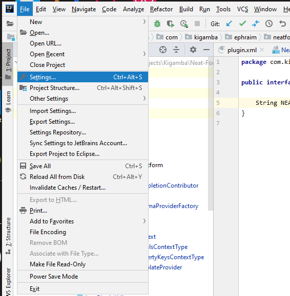
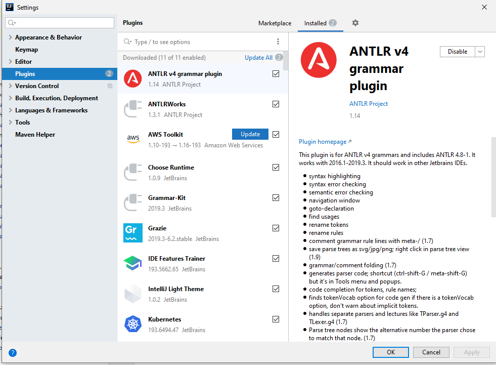
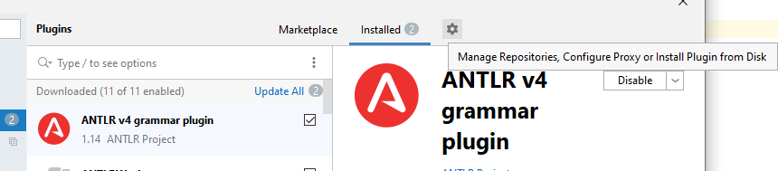
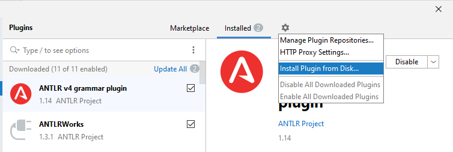
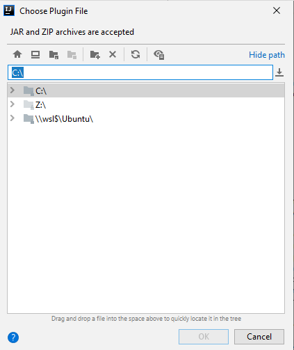
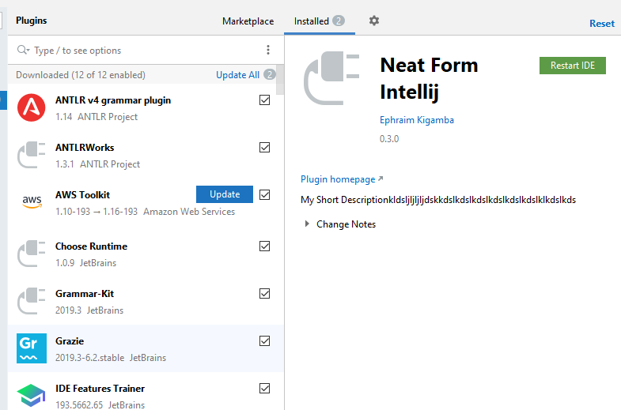

# Neat Form Intellij Plugin
This repo contains the sources for the Neat Form Intellij Plugin

The plugin does the following:

The Neat Form Plugin is an Intellij IDEA & Android Studio plugin that adds autocompletion & error-checking when creating JSON forms to run with [https://github.com/ellykits/NeatForm](https://github.com/ellykits/NeatForm)

The plugin:

- Checks for errors in rule file references - makes sure the declared rules file exists
- Checks for error in field references - makes sure the declared widget exists
- Provides autocomplete for field references - assists you with possible options when references a field by the id
- Provides auto-complete & live-template for form-structure, widgets & specific properties eg.
    - widget
    - form
    - **properties** property
    - property names
- Checks for errors when the widget id has already been used as the id for another widget
- Checks the general structure of the neat json form to ensure the following:
    - Required properties have been declared
    - Property value are within the expected format → numbers, alphanumeric, a range of values, enum value (one of possible values)

## To install the plugin

1. Check the latest plugin in releases [here](https://github.com/Kigamba/Neat-Form-Plugin/releases)
2. Download the jar with the title **Neat.Form.Plugin-x.x.x-plain-json-ext-support.zip** eg. [https://github.com/Kigamba/Neat-Form-Plugin/releases/download/v0.3.0/Neat.Form.Plugin-0.3.0-plain-json-ext-support.zip](https://github.com/Kigamba/Neat-Form-Plugin/releases/download/v0.3.0/Neat.Form.Plugin-0.3.0-plain-json-ext-support.zip)
3. Open your IDE
4. Go to **Settings** as show below

5. Click on **Settings > Plugins** as show below

6. Click on the gear icon next to the **Installed** tab on the window that shows as shown below

7. Click on the **Install Plugin From Disk** option from the drop-down menu that appears

8. Select the jar that you downloaded in step 2 when the following dialog shows

9. Activate the plugin, restart the IDE & you should be good to go. The following is expected once it's installed

**PS: Don't worry about the short description. :smile: You are invited to contribute to the plugin** 

## How to use the plugin

### Create the Neat Form JSON file

If you have done this, jump to the next section. Otherwise, this will detail how to create the file & see the plugin in action

1. 

### Using auto-complete

